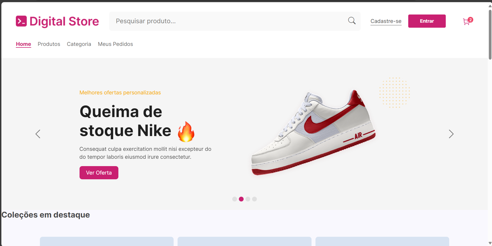
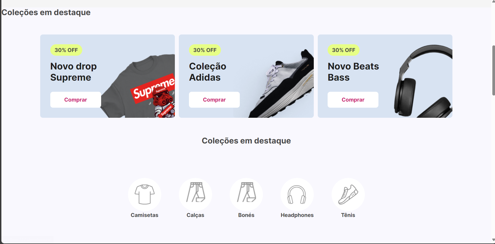
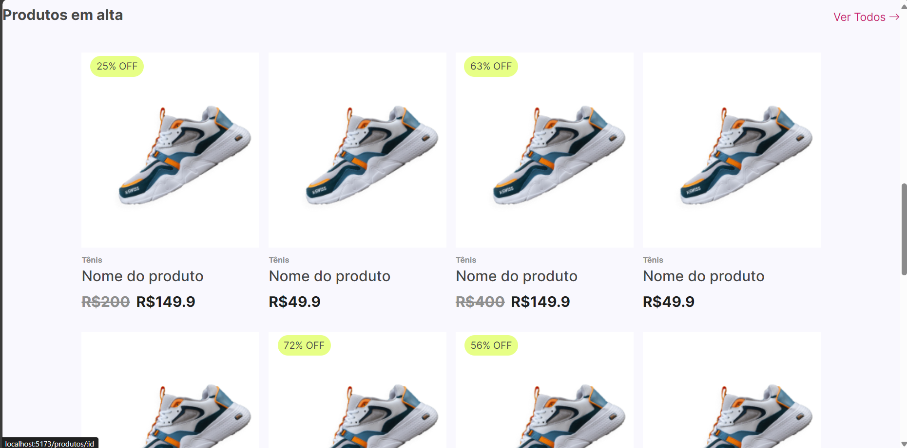
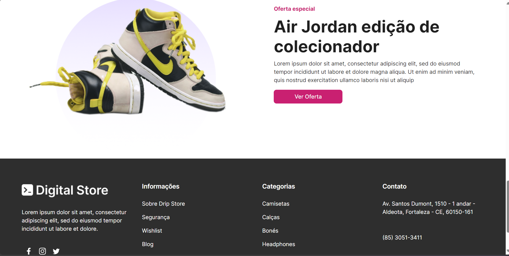
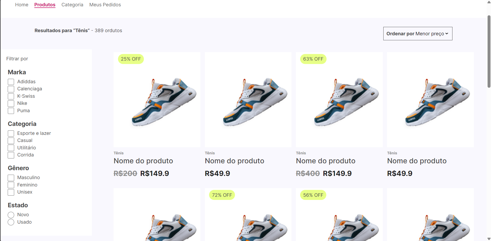
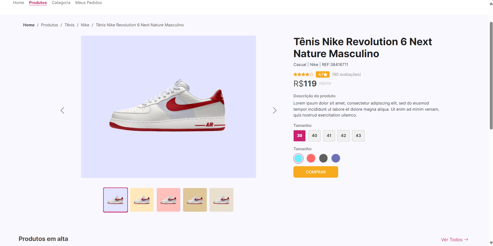
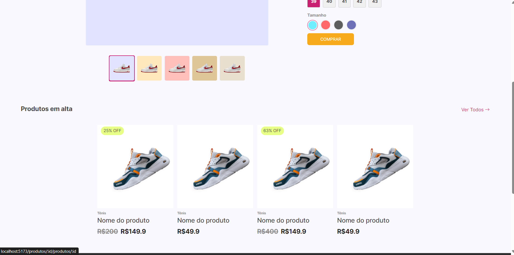

### Digital Store Project 👟

---

#### Descrição
O projeto Digital Store é uma aplicação web criada em React que oferece uma simulação de loja virtual, permitindo aos usuários explorar e filtrar produtos conforme suas preferências. A plataforma é projetada com uma interface amigável, incluindo diversas funcionalidades que otimizam a experiência de navegação e facilitam a escolha e compra de produtos.

---


#### Projeto Desenvolvido por

- Douglas Fernandes de Freitas

---

#### Bibliotecas Utilizadas

1. **React**: Biblioteca central para desenvolvimento da interface do usuário.
2. **Vite**: Ferramenta de build ágil e eficiente para projetos em JavaScript
3. **Bootstrap**: Framework CSS utilizado para estilização e criação de layouts responsivos.
4. **Bootstrap Icons**: Conjunto de ícones compatível com o Bootstrap.
5. **React Router**: Biblioteca para controle de rotas na navegação da aplicação.

---

#### Estrutura dos Componentes

1. **App**: Componente principal que gerencia a estrutura básica da aplicação e define as rotas.
2. **Header**: Exibe o cabeçalho da página, incluindo o menu de navegação.
3. **Footer**: Exibe o rodapé da página com informações adicionais e links úteis.
4. **DescItem**: Exibe informações individuais de cada produto.
5. **Section:** Estrutura e organiza diferentes seções da página.
6. **Gallery:** Exibe os cards de imagens dos produto

---

#### Estrutura das Páginas

1. **HomePage**: Página inicial que recepciona os usuários e apresenta os produtos em destaque.
2. **ProductListPage**: Página de listagem de produtos, com opções de filtros para pesquisa e categorização.
3. **ProductViewPage**: Mostra informações detalhadas sobre um produto específico.

---

#### Imagens do Projeto

Aqui estão algumas capturas de tela do projeto:

1. **Página Inicial**
   
   
   
   


2. **Lista de Produtos**
   

3. **Detalhe do Produto**
   
   

---

#### Como Executar o Projeto

1. Clone o repositório:
   ```sh
   git clone https://github.com/Douglasffjw/Projeto_DigitalStore_DG.git
   ```
2. Navegue até o diretório do projeto:
   ```sh
   cd Projeto_DigitalStore_DG
   cd Digital-Store
   ```
3. Inatale a Biblioteca do vite:
   ```sh 
   npm install vite
   ```

4. Inicie o servidor de desenvolvimento:
   ```sh
   npm run dev
   ```


---

Obrigado pela visita!